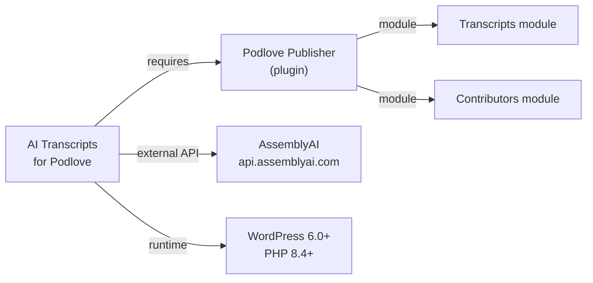
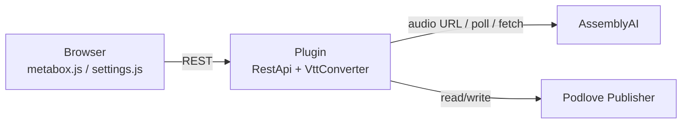
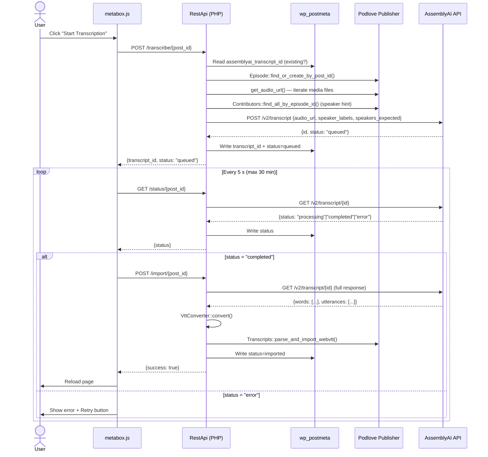

# Architecture

## Overview

AI Transcripts for Podlove is a WordPress plugin that bridges [Podlove Publisher](https://podlove.org/podlove-podcast-publisher/) and the [AssemblyAI](https://www.assemblyai.com/) speech-to-text API. It submits a podcast episode's audio URL to AssemblyAI, polls until transcription is complete, converts the result to WebVTT, and imports it into Podlove's native Transcripts module.

## Dependency Graph

## Component Map

## Components

### Entry Point (`ai-transcripts-for-podlove.php`)

Bootstraps the plugin at `plugins_loaded` priority 20 (after Podlove). Calls `ai_transcripts_check_dependencies()` before initialising anything — it verifies Podlove Publisher is active and that both the **Transcripts** and **Contributors** modules are enabled. Missing dependencies surface as an admin notice; nothing else loads.

### `SettingsPage` (`inc/SettingsPage.php`)

Registers a submenu page under Podlove (falls back to Settings if Podlove is absent). Stores the AssemblyAI API key in `wp_options` under `ai_transcripts_api_key`. On every save it immediately validates the key against `GET /v2/transcript?limit=1` and rejects it (returns `''`) on HTTP 401. On page load it re-checks live and renders a colour-coded status badge (✓ / ✗ / ?). When the key is present, it also loads `settings.js` for batch transcription.

### `MetaBox` (`inc/MetaBox.php`)

Registers the "AssemblyAI Transcription" meta box on the `podcast` post type. Skips registration entirely if no API key is saved. Renders a bare `
` mount point and localises `metabox.js` with the post ID, REST base URL, nonce, and current status from post meta. Also shows a tip prompting the editor to add contributors when none are assigned (contributors improve speaker detection accuracy).

### `RestApi` (`inc/RestApi.php`)

All routes are under the `ai-transcripts-for-podlove/v1` namespace and require `edit_post` capability.

| Route                   | Method | Purpose                                                                   |
| ----------------------- | ------ | ------------------------------------------------------------------------- |
| `/config`               | GET    | Returns `has_api_key`; optionally `has_transcript` for a given `post_id`  |
| `/episodes`             | GET    | Lists all published `podcast` posts with audio/transcript/status metadata |
| `/transcribe/{post_id}` | POST   | Submits audio to AssemblyAI; stores transcript ID + status in post meta   |
| `/status/{post_id}`     | GET    | Polls AssemblyAI and updates post meta status                             |
| `/import/{post_id}`     | POST   | Fetches completed transcript, converts to VTT, imports via Podlove        |

**URL validation** (`validate_public_url`): before submitting to AssemblyAI the audio URL is checked for a public scheme, non-local hostname, and non-private resolved IP — AssemblyAI cannot reach localhost or RFC-1918 addresses.

**Speaker hint**: `get_speakers_expected()` counts `EpisodeContribution` records and passes `speakers_expected` to AssemblyAI when > 0, improving diarization accuracy.

### `VttConverter` (`inc/VttConverter.php`)

Pure static utility. Input is the decoded AssemblyAI JSON (`words` + `utterances` arrays). Output is a valid WebVTT string.

**Speaker map** is built in O(n+m) with a two-pointer walk over the time-sorted `utterances` array, mapping each word index to a speaker label without nested loops.

**Segmentation** groups consecutive words into cues and starts a new cue when any of three conditions is met:

| Condition       | Threshold                              |
| --------------- | -------------------------------------- |
| Cue duration    | > 5 000 ms                             |
| Cue text length | > 84 chars (42 chars × 2 lines)        |
| Speaker change  | speaker label differs from current cue |

Speaker cues are emitted as `<v Speaker A>text` using the WebVTT voice tag format that Podlove's Transcripts module understands.

### `metabox.js` (`assets/js/metabox.js`)

Vanilla JS state machine with states: `idle → confirm → submitting → processing → importing → imported | error`. Polls `/status` every 5 s (max 360 polls / 30 min). On `completed`, immediately calls `/import`. On success, saves a `sessionStorage` flag and reloads the page so the Podlove Transcripts section also refreshes; the flag triggers a smooth scroll back to the meta box after reload.

### `settings.js` (`assets/js/settings.js`)

Batch transcription UI on the settings page. Loads all episodes via `GET /episodes` and renders a selectable table. Processes selected episodes **one at a time** (sequential, not concurrent): submits → polls until complete → imports → moves to next. Provides "Select Without Transcript" and "Select All" shortcuts.

## Data Stored in WordPress

| Storage       | Key                        | Value                                                            |
| ------------- | -------------------------- | ---------------------------------------------------------------- |
| `wp_options`  | `ai_transcripts_api_key`   | AssemblyAI API key string                                        |
| `wp_postmeta` | `assemblyai_transcript_id` | AssemblyAI transcript ID (alphanumeric + hyphens)                |
| `wp_postmeta` | `assemblyai_status`        | One of: `queued`, `processing`, `completed`, `error`, `imported` |

Podlove's transcript content itself is stored in Podlove's own database tables via `Transcripts::parse_and_import_webvtt()`.

## Single-Episode Transcription Flow

